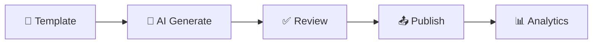

# 👋 Hi, I'm Nathan Fu

  

> 🚀 Building **ContentForge** — an open-source AI-powered content operations platform for SMBs.
> Turning "prompt → template → review → publish" into a seamless pipeline.

---

## 🧑‍💻 About Me

- 🔭 **Currently building:** [ContentForge](https://github.com/NathanymousFu) — AI 内容中台（ToB · 开源 · 轻量）
- 🌱 **Learning:** oRPC, Prisma optimization, AI agent orchestration
- 💬 **Ask me about:** Next.js · TypeScript · AI integration · SaaS architecture
- 📍 **Location:** Shanghai, China
- 🌐 **Website:** [dev.nathanymous.site](https://dev.nathanymous.site)

---

## 🛠️ Tech Stack

  
  
  
  
  
  
  
  
  
  

---

## 🚀 Featured Project

### 🔥 ContentForge — AI Content Operations Platform

| | |
|---|---|
| **定位** | ToB 轻量级 AI 内容运营平台 |
| **核心流程** | 模板 → AI 生成 → 审核 → 多渠道发布 |
| **差异化** | 完整生命周期管理 + 开源可自部署 |
| **技术栈** | Next.js 15 · oRPC · Prisma · PostgreSQL · OpenAI / Claude |

---

## 📊 GitHub Stats

  
  

  

---

## 📫 Let's Connect

  
  
  

---

  <i>⭐️ From <a href="https://github.com/NathanymousFu">NathanymousFu</a> — building in the open.</i>

